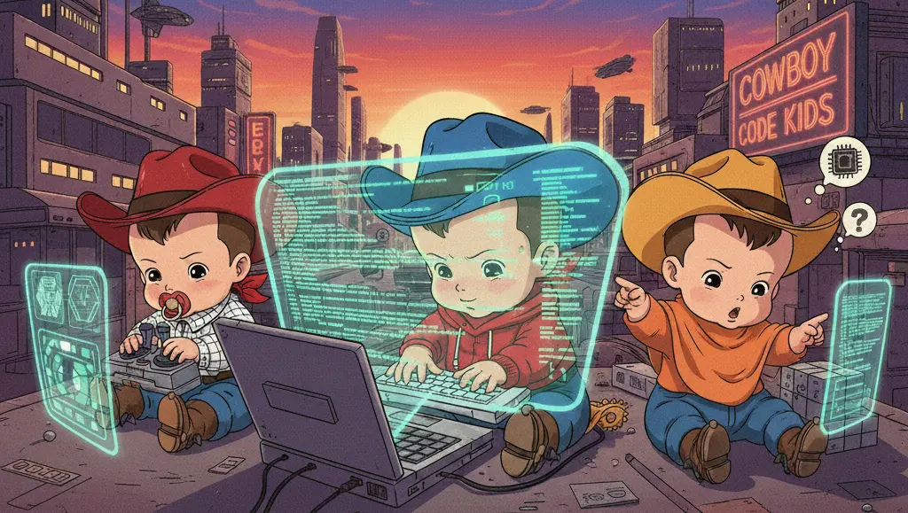

# Gugu Gaga

  

<h1 align="center">👶💻 404 Toddlers</h1>

  Dumb. Silly. Shipped.

---

### What is this?

**404 Toddlers** is a GitHub organization where we build dumb, silly, and experimental side projects.

Every month, we pick an idea that *probably shouldn’t exist* and build it anyway.  
This org exists so we can experiment freely without cluttering our personal profiles.

Some projects work.  
Some don’t.  
That’s the point.

---

### What you’ll find here

- Monthly micro-projects & experiments  
- Meme ideas turned into real code  
- Games, tools, and random concepts  
- No pressure, no polish, just shipping

---

### Why “404 Toddlers”?

Because we’re still learning, still curious, and occasionally clueless —  
but we keep building anyway.

Build dumb things.  
Learn real things.  
Repeat.

---

  Made with ☕, bugs, and bad ideas.

